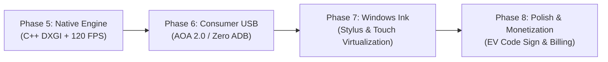

# OpenDisplay USB — Commercial Grade Master Architecture & Roadmap

> **Target Vision:** A commercial-grade, subscription/one-time purchase secondary display solution (competing directly with Duet Display, SuperDisplay, and Spacedesk) offering **glass-to-glass latency < 15ms**, **rock-solid 60–120 FPS**, **zero-config USB plug-and-play (no ADB required)**, and **flawless Windows Extend mode**.

---

## 1. Executive Summary & Current State Audit

### What Was Implemented So Far (Phases 1–4)
* **Android Client (`com.opendisplay.usb`)**:
  - Jetpack Compose UI with reactive state management (`Idle`, `Connecting`, `Streaming`, `Error`).
  - Modular clean architecture (`core:protocol`, `core:transport`, `core:timing`, `core:capabilities`, `video`, `audio`, `input`, `display`, `diagnostics`, `ui`).
  - Asynchronous hardware video decoding via Android `MediaCodec` direct to native `SurfaceView`.
  - Aspect ratio preservation with dynamic letterboxing to prevent font distortion across varying aspect ratios (16:9 laptop to 16:10 / 5:3 tablets).
  - Multi-touch and stylus event capturing serialized to JSON protocol frames.
* **Windows Host Engine (Python)**:
  - Custom OpenDisplay Protocol v1 (`ODSP` binary framing, 11-byte header, JSON control messages, raw NAL binary video payload).
  - Hardware H.264 video encoding via PyAV (FFmpeg NVENC on NVIDIA RTX, with libx264 software fallback).
  - Screen capture using persistent Win32 `CreateDIBSection` memory mapping.
  - Multi-monitor discovery using Win32 `EnumDisplayMonitors`.
  - Signed IddCx Virtual Display Driver bundle with automated installation script.
  - PyQt6 desktop graphical interface with real-time stream diagnostics.

---

## 2. Root Cause Analysis: Why It Currently Feels "Crappy" & Underperforms

| Issue Observed | Root Cause Analysis | Engineering Solution for Release Level |
| :--- | :--- | :--- |
| **Max 27 FPS Bottleneck** | **Win32 GDI `BitBlt` capture overhead + Python GIL**: GDI `BitBlt` executes on the CPU and is throttled by Windows Desktop Window Manager (DWM) composition locks (taking 15–35ms per frame). Python then handles byte copies and FFmpeg GIL locks. | **DXGI Desktop Duplication API + Direct3D 11**: Direct GPU VRAM texture sharing into NVENC/AMF/QuickSync. Frame grab time drops from 25ms to **< 1.5ms**, enabling 60–144 FPS. |
| **Extend Mode Fails / Flaky** | **Missing Programmatic CCD Topology Activation**: Installing the IddCx driver registers the device, but Windows requires active CCD (`SetDisplayConfig`) calls to attach the virtual monitor node to the desktop topology. `DisplaySwitch.exe /extend` alone does not reliably activate newly created virtual displays without an EDID handshake. | **Native Virtual Display Controller**: Implement a dedicated C++ service that calls `SetDisplayConfig` with `SDC_APPLY \| SDC_TOPOLOGY_EXTEND` and manages virtual monitor creation/destruction on connect. |
| **121 FPS Phone Connection Failure** | **Rigid Framerate / Profile Negotiation**: High-refresh devices report non-standard refresh rates (e.g. 120.89 Hz $\to$ 121 Hz). The host encoder attempts to configure NVENC or MediaCodec with level/bitrate constraints outside the codec's High Profile Level 5.1 spec, causing decoder crash or handshake drop. | **Negotiation Ladder & Capability Clamping**: Clamp incoming refresh rates to supported standard tiers (60, 90, 120 FPS) with automatic fallback if decoder configuration rejects parameters. |
| **Unpolished / Amateur UI** | **Developer Controls Exposed in Production**: Exposing options like "Use Mock Loopback Transport" confuses non-technical users. PyQt6 feels like an internal engineering tool rather than a consumer app. | **Modern Electron / Flutter / Tauri UI**: Zero developer clutter. 1-click "Connect", auto-discovery list, visual monitor arrangement drag-and-drop, and resolution/framerate pills. |
| **ADB Requirement** | **Developer-Only Friction**: Requiring USB Debugging and ADB commands makes the app unusable for mainstream consumers. | **Android Open Accessory (AOA 2.0) / WinUSB**: Plug phone via standard USB $\to$ Android prompts "Open OpenDisplay" $\to$ instant connection with ZERO developer settings. |

---

## 3. Commercial Transformation Roadmap (Phases 5 – 8)



### Phase 5: High-Performance Native Core Rewrite (The 120 FPS Engine)
* **Goal**: Eliminate Python bottlenecks, achieve stable 60–120 FPS, sub-12ms latency.
* **Tech Stack**: C++20 or Rust for the Windows Host Daemon.
* **Key Components**:
  1. **DXGI Desktop Duplication Engine**:
     - Grab desktop frames directly in GPU memory using `IDXGIOutputDuplication`.
     - Zero CPU memory copies; direct texture binding to hardware encoders.
  2. **Multi-Vendor Hardware Acceleration**:
     - NVIDIA NVENC (`nvEncodeAPI`)
     - Intel QuickSync Video (MFX / Media SDK)
     - AMD Advanced Media Framework (AMF)
  3. **Ultra-Low Latency Codec Tuning**:
     - CBR mode, zero B-frames (`intra_refresh=true`, slice-based threading).
     - Adaptive bitrate based on socket write buffer pressure.
  4. **Dynamic Framerate Negotiation**:
     - Gracefully handle 60Hz, 90Hz, 120Hz, 144Hz displays with fallback ladders:
       $120\,\text{Hz} \to 90\,\text{Hz} \to 60\,\text{Hz}$.

### Phase 6: True Consumer Plug-and-Play (Ditching ADB for AOA 2.0 / WinUSB)
* **Goal**: Connect instantly when USB cable is plugged in — zero "Developer Options" or "USB Debugging" needed on the phone.
* **Implementation**:
  1. **Android Open Accessory (AOA 2.0)**:
     - Android devices natively support AOA protocol.
     - When plugged into Windows, the PC host sends standard USB control requests to switch the Android USB controller into accessory mode.
     - The Android OS pops up: *"Open OpenDisplay when this accessory is connected?"*
  2. **WinUSB Desktop Driver**:
     - Communicate directly with the Android accessory bulk endpoints using native `WinUSB.sys`.
     - 480 Mbps (USB 2.0) / 5–10 Gbps (USB 3.0/3.1) raw socket throughput with < 1ms transport latency.

### Phase 7: Automated Virtual Display (IddCx) & Windows Ink Stylus
* **Goal**: Flawless secondary monitor creation + turns Samsung S-Pen / Apple Pencil / active styluses into genuine Windows Ink drawing tablets.
* **Implementation**:
  1. **Automated Virtual Monitor Lifecycle**:
     - When Android connects, host automatically creates a virtual display matching the tablet's exact resolution (e.g. $2000 \times 1200$, $2560 \times 1600$, $2880 \times 1800$).
     - Call Windows CCD API (`SetDisplayConfig`) to activate Extend mode seamlessly.
     - Automatically destroy virtual display when disconnected.
  2. **Virtual Digitizer Driver (Windows Ink)**:
     - Map Android stylus pressure ($0.0 - 1.0$), tilt ($X/Y$), and hover to Windows Virtual HID Digitizer.
     - Direct support for Photoshop, Clip Studio Paint, Illustrator, and OneNote.

### Phase 8: Consumer UI, Code Signing & Monetization
* **Goal**: Professional commercial product ready for launch on Google Play & Windows Store.
* **Implementation**:
  1. **Sleek Consumer UI (Tauri / Flutter)**:
     - One-click connect, visual multi-display arrangement, latency indicator, power saving mode.
  2. **Extended Validation (EV) Code Signing**:
     - Sign Windows drivers and executables with an EV Authenticode Certificate to eliminate Windows SmartScreen warnings and UAC friction.
  3. **Monetization Model**:
     - **Free Tier**: 10-minute trial sessions, 30 FPS mirror mode.
     - **Pro License**: One-time purchase (\$14.99) or subscription (\$2.99/mo) unlocking 120 FPS, Extend mode, Windows Ink stylus pressure, and audio pass-through.
     - Google Play Billing + Stripe / LemonSqueezy integration.

---

## 4. Current File & Module Architecture Reference (For Handoff)

```
c:\usbcaster2.0\
├── android\                           # Android Studio Project (Kotlin / Jetpack Compose)
│   ├── app\                           # Main application orchestrator (v0.4.0)
│   ├── core\protocol\                 # ODSP v1 binary packet encoder/decoder
│   ├── core\transport\                # ADB TCP ServerSocket (port 7320)
│   ├── core\capabilities\             # Display refresh rate, resolution, codec probing
│   ├── video\                         # MediaCodec H.264 low-latency decoder & SurfaceView
│   ├── audio\                         # Low-latency AudioTrack playback
│   ├── input\                         # Multi-touch & stylus event serializing
│   └── ui\                            # Compose screens & theme
│
├── windows\                           # Windows Host Engine (Python 3.14 / PyQt6)
│   ├── driver\virtual_display\        # Signed IddCx driver bundle & install_virtual_display.bat
│   ├── src\opendisplay\
│   │   ├── display\capture.py         # Win32 GDI / CreateDIBSection capture engine
│   │   ├── video\encoder.py           # PyAV FFmpeg NVENC / libx264 encoder
│   │   ├── session\controller.py      # ODSP handshake & packet dispatcher
│   │   ├── session\session_manager.py # Reconnection state machine
│   │   ├── transport\adb_transport.py # ADB forward port setup & TCP client
│   │   ├── input\injector.py          # Win32 SendInput touch injection
│   │   └── ui\main_window.py          # PyQt6 modern dark theme desktop UI
│   ├── launch.py                      # Desktop GUI launcher
│   └── stream.py                      # CLI low-latency streamer (--extend / --monitor)
│
└── release_assets\                    # Official Release binaries
    ├── OpenDisplay-Android-v0.4.0.apk
    └── OpenDisplay-Windows-v0.4.1-x64.zip
```

---

## 5. Key Priorities for the Next Engineering Sprint
1. **Rewrite Screen Capture in C++ DXGI**:
   - Replace GDI `BitBlt` with DirectX Desktop Duplication API to unlock genuine 60–120 FPS.
2. **Automate IddCx Virtual Monitor Activation**:
   - Call Windows `SetDisplayConfig` programmatically on connection so Extend mode works out-of-the-box with zero user intervention.
3. **Clamping & Sanitization for Capability Negotiation**:
   - Fix 120Hz/121Hz negotiation crashes by enforcing standard framerate profiles and fallback ladders.
4. **Remove Developer Flags from GUI**:
   - Eliminate "Mock Mode" from production builds to ensure zero user error.
