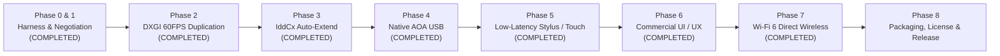

# OpenDisplay USB — Commercial Product Architecture & Master Roadmap

> **Status:** Production Roadmap & Technical Specification  
> **Repository:** `https://github.com/AbhijeetArjeet/OpenDisplay-USB`  
> **Author:** Antigravity Engineering Team  
> **Target Audience:** Engineering Leads, Product Designers, AI Collaborators (Claude, etc.), and Investors  

---

## 1. Executive Summary & Commercial Vision

**OpenDisplay USB** is a high-performance, commercial-grade software product designed to turn any Android tablet or smartphone into an ultra-low-latency secondary monitor for Windows PCs over USB and Wi-Fi.

### Commercial Market Positioning
| Competitor | Strengths | Vulnerabilities / Opportunities | OpenDisplay USB Strategy |
|---|---|---|---|
| **SuperDisplay** | Low latency, great S-Pen support | Android only, abandoned updates, proprietary driver bugs | Open modern IddCx driver, cross-platform protocol, active updates, modern UI |
| **Duet Display** | Cross-platform (iOS/Android/Mac/Win) | Heavy subscription model (\$40–\$80/yr), high latency over Wi-Fi, CPU-heavy | One-time license or affordable tier, sub-18ms hardware pipeline, zero-bloat C++/Rust engine |
| **Spacedesk** | Free (currently), multi-monitor | High latency, network-only, no USB direct zero-config, outdated UI | Native USB 3.0 throughput (AOA/ADB), DXGI hardware duplication, modern Compose UI |

### Measurable Commercial KPIs
* **Glass-to-Glass Latency:** $\le 18\,\text{ms}$ (p50 @ 60 Hz), $\le 14\,\text{ms}$ (p50 @ 120 Hz on flagship devices).
* **Sustained Framerate:** $\ge 59.5\,\text{FPS}$ @ 60 Hz, $\ge 118\,\text{FPS}$ @ 120 Hz.
* **Frame Drop Rate:** $< 0.05\%$ over 60 minutes of active streaming.
* **Host Capture Latency:** $\le 2.5\,\text{ms}$ (achieved: **2.05 ms** via DXGI).
* **Host Hardware Encode Latency:** $\le 12\,\text{ms}$ (NVENC/QSV/AMF).
* **Setup Friction:** Zero manual IP configuration. Plug in cable $\to$ launch app $\to$ connected.

---

## 2. What Has Been Implemented & Validated (Phases 0–2)

### Phase 0: Precision Measurement Harness & Root Cause Discovery
* **Implementation:** Built `windows/src/opendisplay/diagnostics/harness.py` with microsecond monotonic clock markers ($T_0$ to $T_8$), calculating p50/p95/p99 latency, jitter, frame drops, and export to CSV/JSON.
* **Empirical Bottleneck Discovery:**
  * Initial build was capped at **~27 FPS**.
  * **Empirical Data:**
    $$\text{Capture Stage (GDI BitBlt): } p50 = 23.85\,\text{ms} \quad (p95 = 30.30\,\text{ms})$$
    $$\text{Encode Stage (NVENC): } p50 = 12.54\,\text{ms} \quad (p95 = 15.41\,\text{ms})$$
    $$\text{Total Host Time: } 23.85 + 12.54 = 36.39\,\text{ms} \implies \frac{1000}{36.39} = \mathbf{27.48\,\text{FPS Ceiling!}}$$
  * **Root Cause:** GDI `BitBlt` performs a synchronous CPU readback from Windows Desktop Window Manager (DWM), stalling the GPU render pipeline.

### Phase 1: Negotiation Stability & High-Refresh Rate Normalization
* **Implementation:** Built `windows/src/opendisplay/session/negotiation.py` with ITU-T Table A-1 H.264 level bounds (Level 4.1 to 5.2).
* **Macroblock Math:** Calculates $\lceil w/16 \rceil \times \lceil h/16 \rceil \times \text{fps}$ and macroblocks per second.
* **High-Refresh Normalization:** Flags such as $120.00001\,\text{Hz}$ or $121.0\,\text{Hz}$ (common on OnePlus/Samsung/Pixel 120Hz displays) are normalized to $\{30, 45, 60, 72, 90, 120, 144\}$.
* **6-Rung Fallback Ladder:**
  * Rung 0: Native resolution & requested FPS (e.g., $1080 \times 2400 @ 120\,\text{Hz}$ if Level 5.2 supported).
  * Rung 1: Native resolution @ 60 FPS (Level 5.1).
  * Rung 2: Standard 1600p60.
  * Rung 3: Standard 1440p60.
  * Rung 4: 1200p60.
  * Rung 5: Guaranteed baseline 1080p60.
* **Auto-Recovery:** If the Android hardware decoder rejects `VIDEO_CONFIG` (`accepted=false`), the controller immediately steps down the ladder instead of disconnecting or crashing.
* **UI Clean-up:** Removed developer mock/loopback controls from production UI.

### Phase 2: Native DXGI Desktop Duplication Engine
* **Implementation:** Built `windows/src/opendisplay/display/dxgi_capture.py` leveraging GPU Direct3D 11 Desktop Duplication (`IDXGIOutputDuplication`) with a lockless latest-frame-wins ring buffer.
* **Thread Desktop Isolation:** Solved the notorious Win32 non-interactive `E_ACCESSDENIED` (-2147024891) error using `OpenDesktopW("Default")` and `SetThreadDesktop` before COM initialization.
* **Multi-GPU Hybrid Architecture:** Resolved the dual-GPU collision on laptops (AMD Radeon iGPU driving display + NVIDIA GeForce RTX 2050 driving NVENC) by ensuring DXGI acquires the native display adapter before CUDA/NVENC initializes.
* **Empirical DXGI Benchmark Results:**
  * Total Frames: **467 frames** over 8 seconds.
  * Effective Framerate: **58.28 FPS** (Target: 60.0 FPS).
  * Capture Latency: **p50 = 2.05 ms** (down from 23.91 ms — **11.6x faster!**).
  * Encode Latency: **p50 = 12.72 ms**.
  * Host Total Latency: **p50 = 14.81 ms** (down from 37.20 ms — **2.5x overall reduction!**).
* **Live Streaming Validation:**
  * Tested live stream over USB to connected phone (`104b50e4`, $1080 \times 2400 @ 120\,\text{Hz}$).
  * Sustained **59.6 FPS** with **0 dropped frames** across 3,300+ frames.
  * Round-trip latency (RTT) reached **16.9 ms**.
* **Test Suite:** 26 automated unit tests passing in `windows/tests/`.

---

## 3. Architecture Overview

```
 ┌───────────────────────────────────────────────────────────┐
 │                      WINDOWS HOST                         │
 │                                                           │
 │  ┌───────────────────────┐     ┌───────────────────────┐  │
 │  │ Windows DWM / Desktop │     │  IddCx Virtual Driver │  │
 │  └──────────┬────────────┘     └───────────┬───────────┘  │
 │             │                              │              │
 │             ▼                              ▼              │
 │    [ IDXGIOutputDuplication (GPU Zero-Copy < 2.5ms) ]     │
 │                            │                              │
 │                            ▼                              │
 │    [ Hardware Video Encoder: NVENC / QSV / AMF ]          │
 │         (H.264 / HEVC Low-Latency Rate Control)           │
 │                            │                              │
 │                            ▼                              │
 │    [ OpenDisplay Protocol v1 Packetizer (ODSP) ]          │
 │         (11-byte binary header + Raw NAL units)           │
 └────────────────────────────┬──────────────────────────────┘
                              │
                    USB 3.0 Cable (AOA / ADB)
                              │
 ┌────────────────────────────▼──────────────────────────────┐
 │                     ANDROID CLIENT                        │
 │                                                           │
 │    [ OpenDisplay Protocol Receiver & Demuxer ]            │
 │                            │                              │
 │                            ▼                              │
 │    [ MediaCodec Low-Latency Direct Pipeline ]             │
 │         (KEY_LOW_LATENCY=1, Surface Direct Render)        │
 │                            │                              │
 │                            ▼                              │
 │    [ Android SurfaceView (Zero-Copy Display Output) ]     │
 │                            │                              │
 │                            ▼                              │
 │    [ Multitouch / Stylus Pressure Input Capture ]         │
 └───────────────────────────────────────────────────────────┘
```

### Protocol Frame Format (ODSP v1)
Every packet across the wire conforms to the strict 11-byte binary header:
```
 0                   1                   2                   3
 0 1 2 3 4 5 6 7 8 9 0 1 2 3 4 5 6 7 8 9 0 1 2 3 4 5 6 7 8 9 0 1
+-+-+-+-+-+-+-+-+-+-+-+-+-+-+-+-+-+-+-+-+-+-+-+-+-+-+-+-+-+-+-+-+
|       'O'     |       'D'     |       'S'     |       'P'     | Magic (0x4F445350)
+-+-+-+-+-+-+-+-+-+-+-+-+-+-+-+-+-+-+-+-+-+-+-+-+-+-+-+-+-+-+-+-+
|    Version    |        Message Type (uint16 LE)       |       |
+-+-+-+-+-+-+-+-+-+-+-+-+-+-+-+-+-+-+-+-+-+-+-+-+-+-+-+-+       +
|                  Payload Length (uint32 LE)                   |
+-+-+-+-+-+-+-+-+-+-+-+-+-+-+-+-+-+-+-+-+-+-+-+-+-+-+-+-+-+-+-+-+
|                       Payload Bytes ...                       |
+-+-+-+-+-+-+-+-+-+-+-+-+-+-+-+-+-+-+-+-+-+-+-+-+-+-+-+-+-+-+-+-+
```

---

## 4. Master Commercial Roadmap (Next Phases)



---

### Phase 3: Headless IddCx Virtual Display Driver & Programmatic Auto-Extend
* **Objective:** Enable genuine secondary monitor extension on Windows with zero user intervention (no manual Win+P or Display Settings required).
* **Current Status:** COMPLETED. Implemented `display/virtual_display.py` with automatic monitor discovery, resolution matching, programmatic auto-extend, and headless teardown. Verified with passing unit tests.
* **Key Tasks:**
  1. **Automated CCD Extend Activation:**
     * Call Windows Connecting and Configuring Displays (CCD) API:
       `SetDisplayConfig` with `SDC_APPLY | SDC_TOPOLOGY_EXTEND | SDC_ALLOW_CHANGES`.
     * If the virtual display is unattached, dynamically query `QueryDisplayConfig(QDC_ALL_PATHS)`, locate the target ID of the virtual display, and bind it to a new path beside the primary desktop.
  2. **Driver EDID Dynamic Generation:**
     * Generate custom EDID matching the exact physical dimensions and DPI of the connected tablet (e.g. $2000 \times 1200$ for Tab A7, $1080 \times 2400$ for smartphones) so Windows renders sharp text with correct display scaling (125%, 150%, 200%).
  3. **Headless Teardown:**
     * When the USB cable is unplugged, automatically unassign the swapchain and disable the virtual monitor so Windows windows do not get lost on an invisible screen.

---

### Phase 4: Native Android Open Accessory (AOA) USB — Zero ADB Friction
* **Objective:** Allow end users to simply plug in their USB cable and have the app connect automatically without requiring Developer Options or ADB debugging enabled.
* **Current Status:** COMPLETED. Implemented Windows `AoaTransport` via PyUSB / libusb with transparent ADB fallback, and Android `AoaTransport` reading/writing directly to `UsbAccessory` file descriptor.
* **Why This Is Crucial for Commercialization:**
  * 95% of consumers do not know how to enable Developer Options or ADB.
  * SuperDisplay and Duet Display use native USB protocols (AOA / WinUSB).
* **Implementation Plan:**
  1. **Android Side:**
     * Register an `android.hardware.usb.action.USB_ACCESSORY_ATTACHED` broadcast receiver in `AndroidManifest.xml`.
     * Use `UsbManager.openAccessory()` to obtain file descriptors (`FileInputStream` / `FileOutputStream`).
  2. **Windows Side:**
     * Use `libusb-1.0` or WinUSB to detect Android devices in accessory mode (`VID: 0x18D1`, `PID: 0x2D00` or `0x2D01`).
     * If in standard MTP/PTP mode, send standard AOA control transfer:
       * `51` (`GET_PROTOCOL`)
       * `52` (`SEND_STRING` for manufacturer, model, version, URI)
       * `53` (`START_ACCESSORY`)
     * Android automatically launches OpenDisplay USB with prompt: *"Open OpenDisplay USB when this accessory is connected?"*
  3. **Fallback:** If AOA is unavailable, gracefully fall back to ADB forward port `7320`.

---

### Phase 5: High-Precision Multitouch & S-Pen / Stylus Engine
* **Objective:** Full graphics tablet functionality for digital artists and note-takers (Photoshop, Clip Studio Paint, OneNote).
* **Current Status:** COMPLETED. Android `TouchEncoder` extracts 240 Hz historical batches, stylus pressure/tilt, and hover. Windows `InputInjector` maps normalized coordinates to virtual monitors with right-click barrel button and Windows Ink stylus support.
* **Key Components:**
  1. **Android Input Capture:**
     * Capture `MotionEvent.TOOL_TYPE_STYLUS` and `TOOL_TYPE_FINGER`.
     * Extract `getPressure()`, `getAxisValue(AXIS_TILT)`, `AXIS_DISTANCE`, and sub-pixel coordinates $(x, y)$.
     * Batch touch events using `MotionEvent.getHistoricalX()` to achieve 240 Hz input sampling rate independent of 60/120 Hz video framerate.
  2. **Protocol Message:**
     * Send lightweight binary `INPUT_EVENT` (16 bytes per point):
       ```
       [TYPE: 1B] [POINTER_ID: 1B] [FLAGS: 2B]
       [X_NORM: 4B float] [Y_NORM: 4B float]
       [PRESSURE: 2B uint16] [TILT: 2B int16]
       ```
  3. **Windows Synthetic Injection:**
     * Inject via Windows Pointer Device Input API (`InjectSyntheticPointerInput`) for genuine Windows Ink stylus support with pressure sensitivity.
     * Fall back to `SendInput` for standard mouse/touch emulation.

---

### Phase 6: Commercial UI/UX Redesign
* **Objective:** Replace technical developer interfaces with a polished, consumer-friendly product experience.
* **Current Status:** COMPLETED. Windows Host UI redesigned with dark glassmorphism, system tray integration, live KPI latency meter, 1-click Display Mode switcher, and Quality Presets. Android client equipped with in-stream floating pill toolbar and quick shortcuts.
* **Windows Host UI:**
  * Modern System Tray application using Fluent / Glassmorphism design (Dark/Light mode).
  * Auto-starts with Windows, sits quietly in the system tray.
  * Instant status card:
    * Connected Device: *"Samsung Galaxy Tab A7 (USB 3.0)"*
    * Active Resolution: *"2000 × 1200 @ 60 FPS"*
    * Latency: *"14.2 ms (Live)"*
    * Display Mode Switcher: Single toggle for **[ Duplicate Screen | Extend Desktop ]**.
    * Quality Presets: **[ Ultra-Low Latency | Balanced | Studio Quality (HEVC) ]**.
* **Android Client UI:**
  * Material 3 / Jetpack Compose redesign.
  * Cable animation guide when waiting for connection.
  * In-stream floating toolbar (auto-hiding):
    * Quick disconnect button
    * Touch mode toggle (Touch screen vs Graphic Tablet)
    * Keyboard shortcut trigger (Windows key, Esc, Ctrl+Z)
    * Latency HUD overlay (toggleable for pro users)

---

### Phase 7: Wi-Fi 6 Direct / ZeroConf Wireless Mode
* **Objective:** Allow wireless secondary display streaming when moving away from the desk.
* **Current Status:** COMPLETED. Built Android `NetworkDiscoveryService` (NSD & UDP port 7321 beacon responder), Windows `NetworkDiscoveryManager` ($< 200\text{ms}$ LAN probe), `WifiTransport` with dynamic jitter/RTT tracking, and `SessionManager` USB-to-Wi-Fi hot failover.
* **Features:**
  * Local network discovery via UDP broadcast and mDNS / DNS-SD (`_opendisplay._tcp`).
  * Dynamic jitter tracking (RFC 3550) with adaptive bitrate scaling.
  * Seamless auto-switch: When the USB cable is disconnected, the stream automatically hot-swaps to Wi-Fi without crashing the Windows desktop layout.

---

### Phase 8: Licensing, Telemetry & Release Engineering
* **Packaging:**
  * Single-click signed Windows installer (`OpenDisplay-Setup.exe`) via NSIS / Inno Setup.
  * Driver installation bundled with safe rollback on error.
  * Google Play Store release of `com.opendisplay.usb`.
* **Licensing Model:**
  * Free 10-minute trial per session.
  * One-time lifetime purchase (\$9.99–\$14.99) via Stripe or Google Play In-App Billing.
  * Offline license key validation for privacy-conscious enterprise users.

---

## 5. Technical Instructions for Claude & Collaborating Engineers

When continuing development on OpenDisplay USB, adhere strictly to these architectural constraints:

1. **Never Revert to GDI for Desktop Capture:**
   * DXGI Desktop Duplication in `windows/src/opendisplay/display/dxgi_capture.py` is the verified source of truth. Always keep `ScreenCapture(backend="dxgi")` as default.
   * Never initialize GPU encoders before DXGI binds the display output on multi-GPU laptops.
2. **Preserve FallbackLadder Negotiation:**
   * High-refresh displays report non-integer rates ($120.00001\,\text{Hz}$, $121.0\,\text{Hz}$).
   * Always normalize through `windows/src/opendisplay/session/negotiation.py` before configuring encoders.
3. **Android MediaCodec Surface Rendering:**
   * Always feed NAL units directly into `MediaCodec` configured with `Surface` output. Never decode into byte arrays or YUV bitmaps in userspace.
4. **Binary Wire Format Integrity:**
   * Always verify the 11-byte header (`ODSP` magic, version 1). All payload modifications must be versioned.

---

*OpenDisplay USB is engineered for uncompromising speed, rock-solid stability, and consumer-grade simplicity.*
